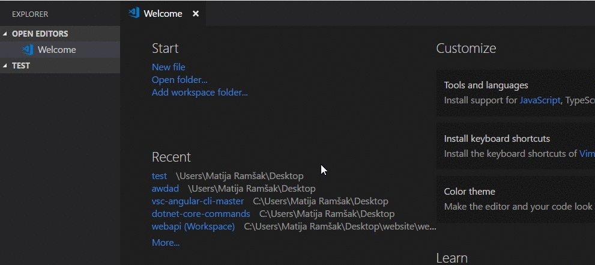
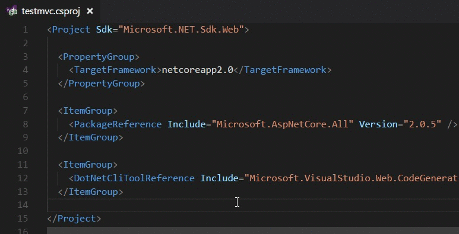
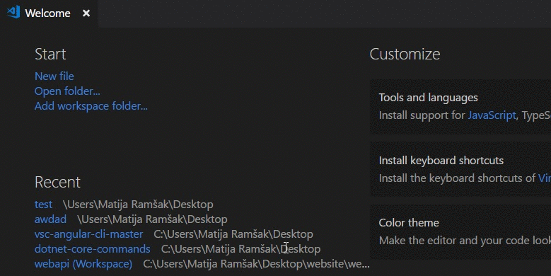

<h1 align="center">
<a href="https://github.com/matijarmk/dotnet-core-commands"></a>
<br>
dotnet core commands
<br>
</h1>
<h4 align="center">Create and modify your dotnet core project. </h4>
<p align="center">Run dotnet from VSCode command panel with default logging. Select the right category and manage NuGet packages, use dotnet core commands and try out EntityFrameworkCore migrations made easy just for you. <a href="https://github.com/matijarmk/dotnet-core-commands/wiki"> Learn More</a>
</p>
<h4 align="center">
 
[](https://marketplace.visualstudio.com/items?itemName=matijarmk.dotnet-core-commands)
[](https://marketplace.visualstudio.com/items?itemName=matijarmk.dotnet-core-commands)
[](https://github.com/matijarmk/dotnet-core-commands/issues)
[](https://github.com/matijarmk/dotnet-core-commands/blob/master/LICENSE)
[](https://github.com/matijarmk/dotnet-core-commands.svg/releases) [](https://vsmarketplacebadge.apphb.com/version-short/matijarmk.dotnet-core-commands.svg) 

</h4>

### Usage

* Simply hit CMD/CTRL + Shift + P or Press F1
* type dotnet

## Features

### Specific feature descriptions.

* Easily display all command categories, by writing dotnet.


* Commands for creating, running and building dotnet core projects and much more.



* NuGet package management. Removing and adding latest NuGet packages was never done easier.



* You won't have to bother remembering commands anytime soon, because we also support EntityFrameworkCore migrations.



---

## Requirements

1. `.NET Core SDK` instalation on your system from [microsoft](https://www.microsoft.com/net/download)

2. Added DotNetCliToolReference on \*.cproj

```xml
<DotNetCliToolReference Include="Microsoft.EntityFrameworkCore.Tools.DotNet" Version="2.0.0" /> current version
```

---

## Known Issues

* None so far

## Release Notes

### [1.0.0] - 2018-02-11

* Initial release of dotnet core commands

<!-- ### 1.0.1

Fixed issue #.

### 1.1.0

Added features X, Y, and Z. -->

---

`Author: Matija Ramšak`

**Enjoy!**
